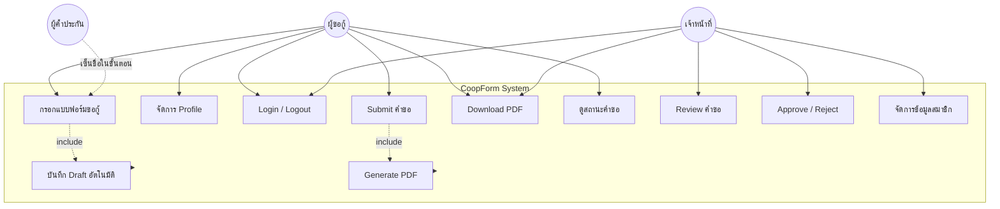
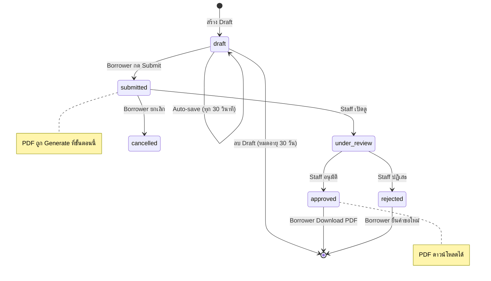
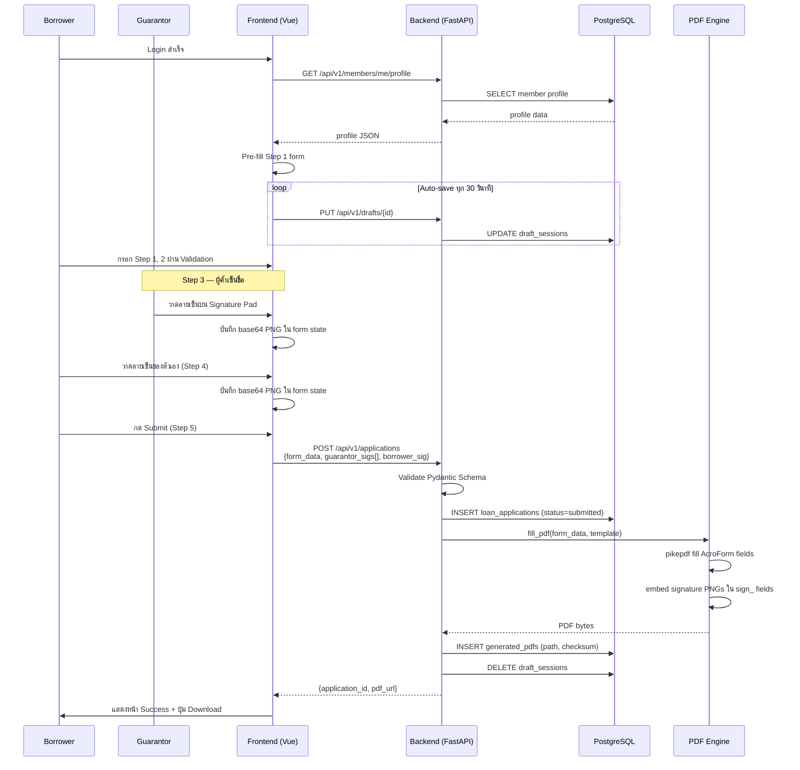

# 03 — Actors, Use Cases & Diagrams

---

## 3.1 Actors

### Primary Actors (ผู้ใช้งานหลัก)

```
┌─────────────────────────────────────────────────────────────┐
│  Actor: Borrower (ผู้ขอกู้ / สมาชิกสหกรณ์)                 │
│  Role: borrower                                              │
│  ──────────────────────────────────────────────────────────  │
│  คำอธิบาย:                                                   │
│    สมาชิกสหกรณ์ออมทรัพย์ที่ต้องการยื่นคำขอกู้เงิน          │
│                                                              │
│  คุณสมบัติ:                                                  │
│    - มี account ในระบบ (Admin สร้างให้)                      │
│    - รู้ข้อมูลส่วนตัวของตัวเอง                               │
│    - ใช้งานบน Desktop หรือ Tablet                            │
│    - ไม่จำเป็นต้องมีความรู้เทคนิค                            │
└─────────────────────────────────────────────────────────────┘

┌─────────────────────────────────────────────────────────────┐
│  Actor: Staff (เจ้าหน้าที่สหกรณ์ / ผู้พิจารณาคำขอ)         │
│  Role: staff                                                 │
│  ──────────────────────────────────────────────────────────  │
│  คำอธิบาย:                                                   │
│    เจ้าหน้าที่สหกรณ์ที่มีหน้าที่ตรวจสอบและพิจารณาคำขอกู้   │
│                                                              │
│  คุณสมบัติ:                                                  │
│    - มี account ในระบบ (role = staff)                        │
│    - เห็นข้อมูลสมาชิกทุกคน                                   │
│    - อนุมัติ/ปฏิเสธคำขอกู้ได้                                │
│    - แก้ไขข้อมูลการเงินสมาชิกได้ (เงินเดือน, ทุนหุ้น)       │
└─────────────────────────────────────────────────────────────┘
```

### Secondary Actors (ผู้เกี่ยวข้อง)

```
┌─────────────────────────────────────────────────────────────┐
│  Actor: Guarantor (ผู้ค้ำประกัน)                            │
│  ──────────────────────────────────────────────────────────  │
│  คำอธิบาย:                                                   │
│    บุคคลที่มาเซ็นชื่อค้ำประกันในขณะที่ผู้กู้กรอกแบบฟอร์ม   │
│    นั่งอยู่ด้วยกัน ณ เวลาที่กรอก                             │
│                                                              │
│  หมายเหตุ:                                                   │
│    ไม่มี account ในระบบ                                      │
│    เซ็นชื่อผ่าน Signature Pad Canvas ในขั้นตอนที่ 3         │
└─────────────────────────────────────────────────────────────┘

┌─────────────────────────────────────────────────────────────┐
│  Actor: System (ระบบอัตโนมัติ)                              │
│  ──────────────────────────────────────────────────────────  │
│  Auto-save Draft ทุก 30 วินาที                               │
│  Expire Draft หลัง 30 วัน                                   │
│  Generate PDF เมื่อ Submit สำเร็จ                           │
└─────────────────────────────────────────────────────────────┘
```

---

## 3.2 Use Case Diagram (System Level)



---

## 3.3 Use Cases รายละเอียด

### UC-01: Login

```
Use Case ID   : UC-01
ชื่อ          : Login
Actor         : Borrower, Staff
Pre-condition : มี account ในระบบ, เข้าหน้า Login
Post-condition: JWT token ออกให้, redirect ไปหน้า Dashboard

Main Flow:
  1. User กรอก email + password
  2. ระบบ validate รูปแบบ input
  3. ระบบตรวจสอบ credentials กับ Database
  4. ระบบออก Access Token + Refresh Token
  5. Redirect ไปหน้า Dashboard ตาม role

Alternative Flow:
  3a. Credentials ผิด → แสดง "อีเมลหรือรหัสผ่านไม่ถูกต้อง" (ไม่บอกว่าอะไรผิด)
  3b. Account inactive → แสดง "บัญชีถูกระงับ กรุณาติดต่อเจ้าหน้าที่"
  2a. Email format ผิด → แสดง validation error ทันที

Business Rule: BR-AUTH-01
```

---

### UC-03: กรอกแบบฟอร์มขอกู้เงิน (7-Tab Wizard — Sprint 6+)

```
Use Case ID   : UC-03
ชื่อ          : กรอกแบบฟอร์มขอกู้เงิน
Actor         : Borrower (หลัก), Guarantor (Tab 3/4), Staff (Tab 5/6 เท่านั้น)
Pre-condition : Login แล้ว, Draft ถูกสร้าง/โหลดอัตโนมัติเมื่อเข้าหน้า
Post-condition: ข้อมูลเก็บใน Draft Session (auto-save ทุก 30 วินาที)

Tabs (Borrower เห็น 5 tabs, Staff เห็น 7 tabs):

  Tab 1 — ข้อมูลผู้กู้ [borrower, staff]
    - Pre-fill จาก Member Profile (Sprint 11 TODO)
    - ชื่อ/นามสกุล, รหัสสมาชิก, เลขบัตรประชาชน, ยศ/ตำแหน่ง, สังกัด
    - ที่อยู่ปัจจุบัน + ที่อยู่ตามทะเบียนบ้าน (6 ช่องแต่ละที่)
    - ข้อมูลรายได้: เงินเดือน, ทุนหุ้น, หนี้สินเดิม, สถานภาพสมรส

  Tab 2 — รายละเอียดเงินกู้ [borrower, staff]
    - จำนวนเงินที่ขอ, จำนวนงวด, วัตถุประสงค์
    - วิธีรับเงิน (โอน/สด) + ข้อมูลบัญชีธนาคาร

  Tab 3 — ผู้ค้ำประกัน (1-3 คน) [borrower, staff]
    - กรอกข้อมูลผู้ค้ำแต่ละคน: ชื่อ, เลขบัตร, ตำแหน่ง, สังกัด, ที่อยู่, สถานภาพสมรส
    - Validate: ต้องมีอย่างน้อย 1 คน (สูงสุด 3 คน — ดู BR-05)

  Tab 4 — เอกสารประกอบ [borrower, staff]
    - Upload ไฟล์แนบ: สำเนาบัตรประชาชน, ทะเบียนบ้าน, สลิปเงินเดือน
    - Max 10MB ต่อไฟล์ (Nginx config)

  Tab 5 — ลงนาม (Signature Hub — Tablet Walk) [borrower, staff]
    - ลายเซ็นผู้กู้ + คู่สมรสผู้กู้ (ถ้าแต่งงาน)
    - ลายเซ็นผู้ค้ำ 1-3 คน + คู่สมรสผู้ค้ำ (ถ้าแต่งงาน)
    - ความเห็นและลายเซ็นหัวหน้างาน
    - ทุก Signature ใช้ Modal Signature Pad Canvas

  Tab 6 — ตรวจสอบ (Staff Only) [staff]
    - Checklist 18 รายการ
    - วิเคราะห์วงเงินกู้ (รายได้, หักรายจ่าย, วงเงินที่ได้)

  Tab 7 — สัญญา (Staff Only) [staff]
    - เลขสัญญา, อัตราดอกเบี้ย, วันที่มีผล
    - ลายเซ็นผู้จัดการ, ประธาน, พยาน 2 คน

Include: UC-04 (Auto-save Draft ทุก 30 วินาที)
Note: ผู้ใช้กระโดดข้ามไปมาระหว่าง tab ได้อิสระ (ไม่บังคับ sequential)
```

---

### UC-05: Submit คำขอกู้

```
Use Case ID   : UC-05
ชื่อ          : Submit คำขอกู้
Actor         : Borrower
Pre-condition : Draft ครบถ้วน, ผ่าน Validation ทุก Step
Post-condition: สร้าง LoanApplication record, PDF ถูก Generate

Main Flow:
  1. Borrower กด "ยืนยันส่งคำขอ" ใน Step 5
  2. ระบบ Validate ข้อมูลทั้งหมดอีกครั้ง (server-side)
  3. ระบบสร้าง LoanApplication record (status = submitted)
  4. ระบบ Generate PDF (UC-06)
  5. ระบบบันทึก PDF metadata
  6. ระบบลบ Draft Session
  7. แสดงหน้า Success พร้อมปุ่ม "Download PDF"

Alternative Flow:
  2a. Validation ล้มเหลว → redirect กลับ Step ที่มีปัญหา
  4a. PDF generation error → บันทึก error log, แจ้ง user "ขอโทษ กรุณาลองใหม่"
      LoanApplication ยังคงอยู่ (status = submitted) และ regenerate ได้
```

---

### UC-09 & UC-10: Staff Review และ Approve/Reject

```
Use Case ID   : UC-09, UC-10
ชื่อ          : Review และ Approve/Reject คำขอกู้
Actor         : Staff
Pre-condition : Login แล้ว (role = staff), มีคำขอที่ status = submitted

Main Flow (UC-09 Review):
  1. Staff เข้า Dashboard → เห็นรายการคำขอทั้งหมด
  2. Staff กรอง/ค้นหาคำขอ (filter by status, date, member)
  3. Staff คลิกดูรายละเอียดคำขอ
  4. Staff ดาวน์โหลด PDF และตรวจสอบ

Main Flow (UC-10 Approve):
  5a. Staff กด "อนุมัติ" + กรอก remark (optional)
  6a. ระบบอัปเดต status = approved, บันทึก reviewed_by, reviewed_at
  7a. สมาชิกเห็นสถานะ "อนุมัติแล้ว" ใน Dashboard

Main Flow (UC-10 Reject):
  5b. Staff กด "ปฏิเสธ" + กรอก remark (required)
  6b. ระบบอัปเดต status = rejected
  7b. สมาชิกเห็นสถานะ "ปฏิเสธ" พร้อมเหตุผล
```

---

## 3.4 Application Status State Machine



---

## 3.5 Sequence Diagram — กรอกแบบฟอร์มและ Generate PDF


