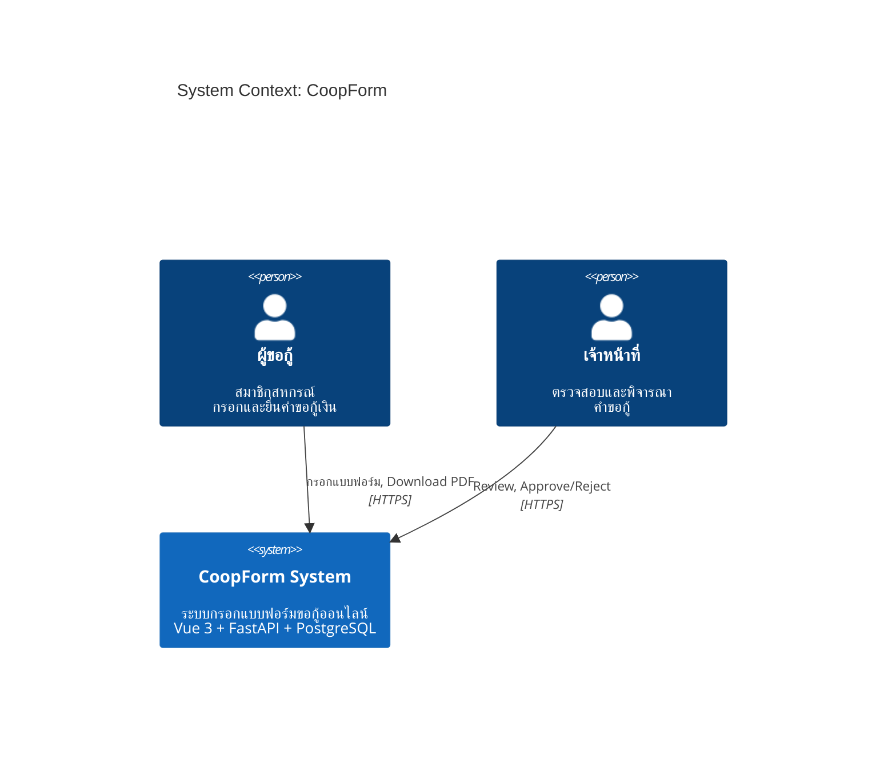
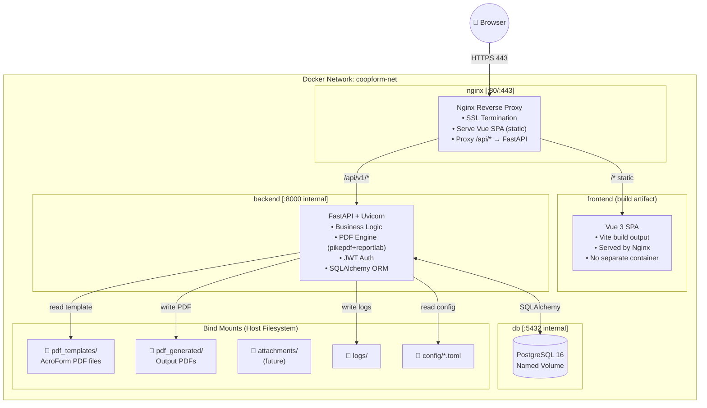
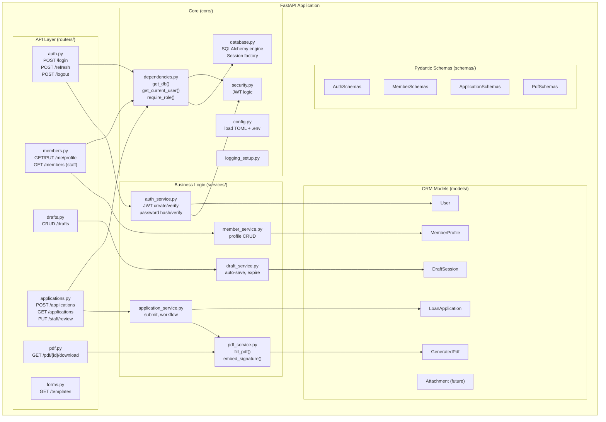

# 04 — System Architecture & Component Diagrams

---

## 4.1 Architecture Overview (C4 — Level 1: System Context)



---

## 4.2 Container Architecture (C4 — Level 2)



> **Note:** Frontend Vue SPA ถูก build เป็น static files แล้ว copy เข้า nginx container  
> ไม่มี separate frontend container ลดความซับซ้อน

---

## 4.3 Component Architecture (C4 — Level 3: Backend)



---

## 4.4 Component Architecture — Frontend (Vue 3)

```mermaid
graph TB
    subgraph Vue3["Vue 3 SPA"]
        subgraph Pages["Pages (Route-level)"]
            P_LOGIN["LoginPage.vue"]
            P_DASH["DashboardPage.vue<br/>(borrower)"]
            P_FORM["ApplicationPage.vue<br/>(form wizard container)"]
            P_DETAIL["ApplicationDetailPage.vue"]
            P_PROF["ProfilePage.vue"]
            P_STAFF["staff/StaffDashboard.vue"]
            P_REV["staff/ReviewPage.vue"]
        end

        subgraph FormComponents["Form Components (src/forms/ — Sprint 10 restructure)"]
            subgraph OrdinaryLoan["forms/ordinary-loan/"]
                OL_WIZ["OrdinaryLoanWizard.vue (TABS registry)"]
                OL_S2["Step2LoanDetails.vue"]
                OL_S3["Step3Guarantors.vue"]
            end
            subgraph SharedForms["forms/shared/"]
                SH_S1["Step1PersonalInfo.vue"]
                SH_ATT["StepAttachments.vue ⚠️"]
                SH_S4["Step4SignatureHub.vue"]
                SH_BASE["BaseWizardLayout.vue"]
            end
            subgraph StaffForms["forms/staff/"]
                ST_S5["Step5StaffVerification.vue"]
                ST_S6["Step6ContractFinalization.vue"]
            end
            subgraph EmergencyLoan["forms/emergency-loan/ (hidden — Sprint 11)"]
                EM_STUB["EmergencyLoanWizard.vue (stub)"]
            end
        end

        subgraph UI["UI Primitives (Shared)"]
            UI_IN["UiInput.vue"]
            UI_SEL["UiSelect.vue"]
            UI_CHK["UiCheckbox.vue"]
            UI_BTN["UiButton.vue"]
            UI_SIG["UiSignaturePad.vue"]
            UI_MOD["UiModal.vue"]
            UI_PROG["UiProgressBar.vue"]
            UI_ALRT["UiAlert.vue"]
        end

        subgraph Layout["Layout"]
            L_HDR["AppHeader.vue"]
            L_NAV["AppNav.vue"]
        end

        subgraph Stores["Pinia Stores"]
            ST_AUTH["auth.store.ts<br/>user, token"]
            ST_FORM["form.store.ts<br/>form data, step, auto-save, submit"]
            ST_UI["ui.store.ts<br/>theme"]
            ST_PROF["profile.store.ts<br/>member profile + step1Prefill"]
            ST_TOAST["toast.store.ts<br/>global notifications (Sprint 10)"]
            ST_NOTIF["notification.store.ts<br/>bell notifications"]
        end

        subgraph Composables["Composables (ViewModel)"]
            CO_AUTH["useAuth.ts"]
        end

        subgraph Services["API Services"]
            SV_API["api.service.ts<br/>Axios instance + interceptors"]
            SV_AUTH["auth.service.ts"]
            SV_FORM["form.service.ts"]
            SV_APP["application.service.ts"]
        end

        Router["Vue Router<br/>Route Guards (auth + role)"]
    end

    P_FORM --> OL_S1 & OL_S2 & OL_S3 & OL_S4 & OL_S5
    OL_S1 & OL_S2 & OL_S3 --> UI_IN & UI_SEL & UI_CHK
    OL_S3 & OL_S4 --> UI_SIG
    P_FORM --> CO_WIZ --> ST_FORM
    CO_WIZ --> CO_SAVE --> SV_FORM
    P_LOGIN --> CO_AUTH --> ST_AUTH --> SV_AUTH
    Router --> ST_AUTH
```



---

## 4.5 MVVM Pattern Mapping

```
┌────────────────────────────────────────────────────────────┐
│  MODEL                                                      │
│    Backend: SQLAlchemy ORM models + PostgreSQL              │
│    Frontend: Pinia stores (reactive state)                  │
├────────────────────────────────────────────────────────────┤
│  VIEWMODEL                                                  │
│    Vue Composables (useFormWizard, useAuth, ...)            │
│    → รับ action จาก View                                   │
│    → เรียก API Service                                      │
│    → อัปเดต Pinia Store                                    │
│    → ไม่รู้จัก DOM โดยตรง                                   │
├────────────────────────────────────────────────────────────┤
│  VIEW                                                       │
│    Vue Components + Pages                                   │
│    → bind กับ Pinia store (computed)                       │
│    → emit events ไปยัง composables                         │
│    → ไม่มี business logic                                   │
└────────────────────────────────────────────────────────────┘
```

---

## 4.6 Technology Stack Summary

| Layer | Technology | Version | เหตุผล |
|-------|-----------|---------|--------|
| Frontend Framework | Vue 3 | 3.4+ | Composition API, Ecosystem ดี |
| Build Tool | Vite | 5.x | Fast HMR, ESM native |
| State Management | Pinia | 2.x | Vue 3 standard, TypeScript friendly |
| UI Framework | DaisyUI + Tailwind CSS | v5.5.19 / v4.2.4 | Component-rich, ประหยัดเวลา (อัปเกรดใน Sprint 4.5) |
| Form Validation | VeeValidate + Zod | latest | Schema-driven validation |
| HTTP Client | Axios | 1.x | Interceptors, ใช้งานง่าย |
| Signature | signature_pad | 4.x | Industry standard, zero deps |
| Language (FE) | TypeScript | 5.x | Type safety |
| Backend Framework | FastAPI | 0.110+ | Async, Auto OpenAPI, Type safe |
| Server | Uvicorn | latest | ASGI, Production ready |
| ORM | SQLAlchemy | 2.0 | Async support, Industry standard |
| Migration | Alembic | latest | SQLAlchemy native |
| Schema Validation | Pydantic | v2 | FastAPI native, Fast |
| Auth | python-jose + bcrypt (direct) | latest | JWT + bcrypt — passlib ลบออกเพราะ incompatible กับ bcrypt ≥ 4.0 (Sprint 4) |
| Rate Limiting | slowapi | latest | FastAPI middleware |
| PDF Fill | pikepdf | 10.x | AcroForm manipulation |
| PDF Render | reportlab | 4.x | Thai font appearance stream |
| Image | Pillow | latest | Signature PNG processing |
| Database | PostgreSQL | 16 | ACID, JSONB, Reliable |
| Reverse Proxy | Nginx | alpine | SSL termination, Static serve |
| Container | Docker + Compose | latest | 3-container setup |
