# 05 — Database Design

---

## 5.1 ERD (Entity Relationship Diagram)

```mermaid
erDiagram
    USERS {
        uuid        id              PK
        string      email           UK
        string      hashed_password
        string      role            "borrower | staff"
        string      member_code     UK
        boolean     is_active
        timestamp   created_at
    }

    MEMBER_PROFILES {
        uuid        id              PK
        uuid        user_id         FK
        string      title
        string      position
        string      department
        decimal     salary
        decimal     shares_amount
        decimal     existing_debt
        string      phone
        jsonb       addresses       "Home & Office addresses"
        timestamp   updated_at
    }

    LOAN_APPLICATIONS {
        uuid        id              PK
        string      application_no  UK  "ORD-2568-00001"
        uuid        applicant_id    FK  "The primary borrower"
        string      form_type       "ordinary | emergency | special"
        string      status          "draft|submitted|approved|rejected"
        decimal     requested_amount
        integer     requested_term
        jsonb       form_details    "Specific form fields (checklist, etc)"
        uuid        reviewed_by     FK
        timestamp   submitted_at
        timestamp   created_at
    }

    APPLICATION_PARTIES {
        uuid        id              PK
        uuid        application_id  FK
        uuid        member_id       FK  "Nullable (e.g. non-member spouse)"
        string      role            "BORROWER | GUARANTOR | SPOUSE_BORROWER | SPOUSE_GUARANTOR | SUPERIOR | WITNESS"
        string      full_name       "Snapshot at time of signing"
        string      position        "Snapshot"
        string      department      "Snapshot"
        string      national_id     "Snapshot"
        jsonb       address_snapshot "Snapshot"
        integer     sequence        "Order of appearance (e.g. Guarantor 1, 2)"
    }

    SIGNATURES {
        uuid        id              PK
        uuid        party_id        FK  "1-to-1 with Application Party"
        text        signature_data  "Base64 image or file path"
        string      ip_address
        string      user_agent
        timestamp   signed_at
    }

    DRAFT_SESSIONS {
        uuid        id              PK
        uuid        user_id         FK
        string      form_type
        jsonb       form_data
        timestamp   last_saved_at
    }

    GENERATED_PDFS {
        uuid        id              PK
        uuid        application_id  FK
        string      storage_path
        string      checksum_sha256
        timestamp   generated_at
    }

    ATTACHMENTS {
        uuid        id              PK
        uuid        application_id  FK
        string      doc_type        "ID_CARD | HOUSE_REG | SALARY_SLIP"
        string      storage_path
        timestamp   uploaded_at
    }

    USERS ||--|| MEMBER_PROFILES     : "has"
    LOAN_APPLICATIONS ||--o{ APPLICATION_PARTIES : "has many parties"
    APPLICATION_PARTIES ||--o| SIGNATURES : "signs"
    LOAN_APPLICATIONS ||--o| GENERATED_PDFS : "generates"
    LOAN_APPLICATIONS ||--o{ ATTACHMENTS : "has"
    USERS ||--o{ LOAN_APPLICATIONS : "reviews (staff)"
```



---

## 5.2 Table Descriptions

### USERS
จัดการ authentication และ role เท่านั้น — ไม่เก็บข้อมูล profile ที่นี่

| Column | Type | Constraint | หมายเหตุ |
|--------|------|-----------|---------|
| `id` | UUID | PK, default gen_random_uuid() | |
| `email` | VARCHAR(255) | UNIQUE, NOT NULL | ใช้ login |
| `hashed_password` | VARCHAR(255) | NOT NULL | bcrypt |
| `role` | VARCHAR(20) | NOT NULL | 'borrower' หรือ 'staff' |
| `member_code` | VARCHAR(20) | UNIQUE | รหัสสมาชิก 6 หลัก |
| `national_id` | VARCHAR(13) | UNIQUE | เลขบัตรประชาชน |
| `first_name` | VARCHAR(100) | NOT NULL | |
| `last_name` | VARCHAR(100) | NOT NULL | |
| `is_active` | BOOLEAN | default TRUE | ปิดแทน delete |

### LOAN_APPLICATIONS — form_data JSONB Structure

`form_data` เก็บข้อมูลทั้งหมดในแบบฟอร์มเป็น JSONB เพื่อรองรับหลายประเภทแบบฟอร์ม:

```json
{
  "form_type": "ordinary",
  "step1": {
    "write_at": "สภ.เมืองพิษณุโลก",
    "write_date": "6 เมษายน 2568",
    "fullname": "ด.ต. สมชาย รักชาติ",
    "position": "ผบ.หมู่ (ป.)",
    "department": "ภ.จว.พิษณุโลก",
    "member_id": "123456",
    "national_id": "1-5501-12345-67-8",
    "salary_type": "salary",
    "salary_amount": "40000",
    "addr": { "house_no": "99/1", "moo": "5", ... },
    "addr2": { ... }
  },
  "step2": {
    "loan_amount": "500000",
    "loan_amount_text": "ห้าแสนบาทถ้วน",
    "installments": "96",
    "interest_rate": "5.75",
    "purpose": "ชำระหนี้และปรับปรุงที่อยู่อาศัย",
    "recv_method": "book_bank",
    "bank_name": "กรุงไทย",
    "bank_branch": "พรหมพิราม",
    "account_no": "1234567890",
    "account_name": "สมชาย รักชาติ"
  },
  "signatures": {
    "borrower_sig_base64": "data:image/png;base64,...",
    "guarantor_sigs": [
      { "name": "พ.ต.ต. วีระ สุขใจ", "sig_base64": "..." }
    ]
  }
}
```

### DRAFT_SESSIONS
- 1 user มีได้ 1 draft ต่อ form_type (UNIQUE constraint บน user_id + form_type)
- expires_at = created_at + 30 days
- ลบอัตโนมัติเมื่อ Submit สำเร็จ หรือ expired

---

## 5.3 Indexes

```sql
-- USERS
CREATE UNIQUE INDEX idx_users_email ON users(email);
CREATE UNIQUE INDEX idx_users_member_code ON users(member_code);
CREATE UNIQUE INDEX idx_users_national_id ON users(national_id);

-- LOAN_APPLICATIONS
CREATE UNIQUE INDEX idx_apps_application_no ON loan_applications(application_no);
CREATE INDEX idx_apps_applicant_id ON loan_applications(applicant_id);
CREATE INDEX idx_apps_status ON loan_applications(status);
CREATE INDEX idx_apps_form_type ON loan_applications(form_type);
CREATE INDEX idx_apps_submitted_at ON loan_applications(submitted_at DESC);

-- DRAFT_SESSIONS
CREATE UNIQUE INDEX idx_drafts_user_form_type ON draft_sessions(user_id, form_type);
CREATE INDEX idx_drafts_expires_at ON draft_sessions(expires_at);

-- AUDIT_LOGS
CREATE INDEX idx_audit_user_id ON audit_logs(user_id);
CREATE INDEX idx_audit_entity ON audit_logs(entity_type, entity_id);
CREATE INDEX idx_audit_created_at ON audit_logs(created_at DESC);
```

---

## 5.4 Application Number Generation

```
รูปแบบ: {TYPE_PREFIX}-{YEAR_BE}-{SEQUENCE}
ตัวอย่าง: ORD-2568-00001

TYPE_PREFIX:
  ORD = กู้สามัญ
  EMG = กู้ฉุกเฉิน
  SPL = กู้พิเศษ

YEAR_BE: ปี พ.ศ. 2 หลักท้าย (2568 → 68) หรือ 4 หลัก
SEQUENCE: running number 5 หลัก ต่อปีต่อประเภท
```

---

## 5.5 Migration Strategy

```
ใช้ Alembic + SQLAlchemy 2.0

migrations/
└── versions/
    ├── 001_initial_schema.py     ← users, member_profiles
    ├── 002_loan_tables.py        ← loan_applications, draft_sessions, generated_pdfs
    ├── 003_parties_signatures.py ← application_parties, signatures (Sprint 7 — Snapshot Pattern)
    ├── 004_attachments.py        ← attachments table (Sprint 9)
    └── 005_audit_logs.py         ← audit_logs table (Sprint 8/9)

หมายเหตุ Sprint 7: เพิ่ม application_parties + signatures เพื่อรองรับ Legal Snapshot Architecture
  - application_parties: บันทึก snapshot ของทุกฝ่าย ณ วันที่ submit (ชื่อ, ตำแหน่ง, ที่อยู่)
  - signatures: เก็บ base64 + ip_address + signed_at ต่อ party

คำสั่ง:
  alembic upgrade head    → apply all migrations
  alembic downgrade -1   → rollback 1 step
  alembic revision --autogenerate -m "description"

Dev DB: SQLite+aiosqlite (ไม่ต้อง Docker container)
  DATABASE_URL=sqlite+aiosqlite:///./coopform_dev.db
  ⚠️ ใช้ sa.Uuid + sa.JSON (generic) ไม่ใช้ postgresql.UUID/JSONB — SQLite compat
  ⚠️ Unique constraints ใช้ create_index(..., unique=True) ไม่ใช้ create_unique_constraint
```
