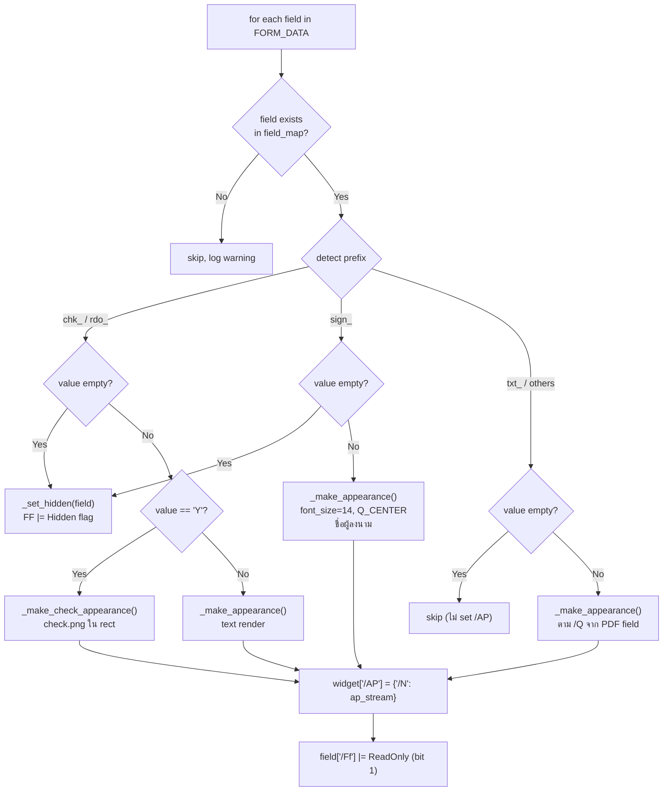

# 08 — PDF Engine Design

> **หมายเหตุ:** เนื้อหาในไฟล์นี้อ้างอิงจากผลการทดสอบจริงใน Sprint 1 และ Sprint 2  
> โค้ดต้นแบบอยู่ที่ `my_workspace/tee_temp/test/test.py`

---

## 8.1 PDF Template ต้นแบบ

```
ชื่อไฟล์  : สัญญาเงินกู้สามัญ สอ.ภ.6-fillable.pdf
ประเภท   : AcroForm Fillable PDF (Adobe Acrobat Pro DC)
หน้า     : 15 หน้า (fields อยู่ในหน้า 1-5, หน้า 6-15 คือเนื้อหาสัญญา)
Fields   : 150 fields

การกระจาย:
  /Tx  (Text)   : 82 fields
  /Btn (Button) : 68 fields
    ├── chk_  : checkbox fields
    └── sign_ : signature placeholder fields (Pushbutton, Ff=65536)

Field Prefix Convention:
  txt_   → Text field (กรอกข้อความ)
  chk_   → Checkbox (ติ๊กถูก/ซ่อน)
  sign_  → Signature placeholder (Pushbutton ใช้เป็น signature area)
  rdo_   → Radio button group (ไม่มีในไฟล์นี้ แต่โค้ดรองรับ)
```

---

## 8.2 ทำไมต้องใช้ pikepdf + reportlab (ไม่ใช้ pypdf)

### ปัญหาที่พบจาก Sprint 1

```
ปัญหา 1: pypdf.update_page_form_field_values() ไม่ match field
  → ชื่อ field ใน AcroForm ใช้ dot notation (txt_p2.pookoo.geninfo.fullname)
  → pypdf ไม่รองรับ hierarchy นี้ได้ครบถ้วน

ปัญหา 2: Thai font แสดงผิด
  → pypdf ใช้ WinAnsiEncoding → ภาษาไทยเป็น ? หรือ □
  → ต้องสร้าง appearance stream เอง

ปัญหา 3: บาง field ไม่มี /Rect ที่ parent
  → ต้องหา /Rect จาก /Kids widget

วิธีแก้: ใช้ pikepdf navigate AcroForm โดยตรง + reportlab สร้าง appearance stream
```

### Library Roles

| Library | บทบาท |
|---------|-------|
| `pikepdf 10.5.1` | Navigate AcroForm hierarchy, ตั้งค่า /V, /AP, /Ff, /F |
| `reportlab 4.4.10` | สร้าง appearance stream พร้อม TH Sarabun New font |
| `Pillow` | Process signature PNG (decode base64, resize) |

---

## 8.3 Field Processing Logic



---

## 8.4 Appearance Stream Architecture

### Text Field (_make_appearance)

```python
def _make_appearance(dest_pdf, value, rect, font_size=16, quadding=Q_LEFT):
    """
    1. สร้าง mini PDF ด้วย reportlab (w×h ของ field)
    2. วาดข้อความด้วย THSarabunNew font
    3. อ่าน content stream + font resources จาก mini PDF
    4. สร้าง Form XObject ใน dest_pdf
    5. Copy font resources (pikepdf.copy_foreign)
    6. คืน ap_stream
    """
```

**Quadding (Text Alignment):**
```
Q=0 → Left  (ชิดซ้าย, x=2)
Q=1 → Center (กึ่งกลาง, x=w/2)
Q=2 → Right  (ชิดขวา, x=w-2)
```

### Checkbox Field (_make_check_appearance)

```python
def _make_check_appearance(dest_pdf, rect, img_path):
    """
    1. สร้าง mini PDF ด้วย reportlab
    2. วาด check.png (512×512 RGBA) ใน rect ขนาดเท่า field
    3. Copy XObject resources (image) ไปยัง dest_pdf
    4. คืน ap_stream
    """
```

### Signature Field

```
sign_ fields เป็น Pushbutton (Ff=65536)
มี /Kids แต่ละตัวมี /Rect

วิธี embed signature:
Option A (Sprint 2 current): render ชื่อผู้ลงนามเป็นข้อความกึ่งกลาง
Option B (Production target): decode base64 PNG → embed เป็น XObject image
                              (เหมือน check.png แต่ใช้ภาพลายเซ็นจริง)
```

---

## 8.5 Signature PNG Processing (Production Flow)

```python
def _make_signature_appearance(dest_pdf, rect, sig_base64: str):
    """
    1. Decode base64 → bytes
    2. Pillow: open image → convert RGBA → trim whitespace
    3. Resize ให้พอดี rect (maintain aspect ratio, padding 2px)
    4. Save เป็น PNG bytes
    5. ใช้ reportlab embed เป็น appearance stream
    """
    import base64
    from PIL import Image
    
    # decode base64
    sig_bytes = base64.b64decode(sig_base64.split(',')[1])
    img = Image.open(io.BytesIO(sig_bytes)).convert('RGBA')
    
    # trim whitespace (optional)
    # resize to fit rect
    x1, y1, x2, y2 = [float(v) for v in rect]
    w, h = x2-x1, y2-y1
    img.thumbnail((w*2, h*2), Image.LANCZOS)
    
    # embed ด้วย reportlab
    buf = io.BytesIO()
    img.save(buf, format='PNG')
    buf.seek(0)
    
    # ... (เหมือน _make_check_appearance แต่ใช้ buf แทน img_path)
```

---

## 8.6 PDF Field Mapping Table (Sprint 1/2 Verified)

| Web Form Field | PDF AcroForm Field | Type | Page |
|---------------|-------------------|------|------|
| write_at | txt_p2.geninfo.write_at | Tx | 2 |
| write_date | txt_p2.geninfo.write_date | Tx | 2 |
| fullname | txt_p2.pookoo.geninfo.fullname | Tx | 2 |
| position | txt_p2.pookoo.geninfo.position | Tx | 2 |
| department | txt_p2.pookoo.geninfo.sangud | Tx | 2 |
| member_id | txt_p2.pookoo.geninfo.mem_id | Tx | 2 |
| national_id | txt_p2.pookoo.geninfo.card_id | Tx | 2 |
| has_salary (Y/N) | chk_p2.pookoo.geninfo.has_sarary | Btn | 2 |
| has_wage (Y/N) | chk_p2.pookoo.geninfo.has_wage | Btn | 2 |
| salary_amount | txt_p2.pookoo.geninfo_sarary_amount | Tx | 2 |
| addr_house_no | txt_p2.pookoo.addr.house_no | Tx | 2 |
| loan_amount | txt_p4.ordinary_loan_agreement.pookoo.ch1.amount | Tx | 4 |
| loan_amount_text | txt_p4.ordinary_loan_agreement.pookoo.ch1.amount_text | Tx | 4 |
| installments | txt_p4.ordinary_loan_agreement.pookoo.ch2.ch_no | Tx | 4 |
| interest_rate | txt_p4.ordinary_loan_agreement.pookoo.ch2.interest_rate | Tx | 4 |
| borrower_sig | sign_p2.pookoo.sign | Btn(push) | 2 |
| guarantor_sig_1 | sign_p2.payarn.sign | Btn(push) | 2 |
| supervisor_sig | sign_p3.supervisor_comments.sign | Btn(push) | 3 |

> ดู mapping ครบทั้ง 150 fields ได้ที่ `my_workspace/tee_temp/test/test.py` — FORM_DATA dictionary

---

## 8.7 pdf_service.py Interface (สำหรับ FastAPI)

```python
class PdfService:
    def fill_ordinary_loan(
        self,
        form_data: OrdinaryLoanFormData,  # Pydantic model
        template_path: Path,
        output_path: Path
    ) -> GeneratedPdfInfo:
        """
        1. map form_data fields → PDF field names (ตาม FORM_DATA structure)
        2. map signatures → base64 PNG
        3. เรียก fill_pdf() จาก pdf_engine.py
        4. บันทึกไฟล์ → output_path
        5. คำนวณ checksum SHA256
        6. คืน GeneratedPdfInfo (path, size, checksum)
        """
```

---

## 8.8 Error Handling

| สถานการณ์ | การจัดการ |
|---------|---------|
| Font file ไม่พบ | raise FileNotFoundError ก่อน process |
| Field ไม่มี /Rect | log warning, ข้าม field นั้น (ไม่ abort ทั้งหมด) |
| Image decode ล้มเหลว | raise ValueError, return error response |
| pikepdf save ล้มเหลว | raise, clean up temp file, return 500 |
| reportlab render error | log, fallback เป็นข้อความว่างหรือ raise |
