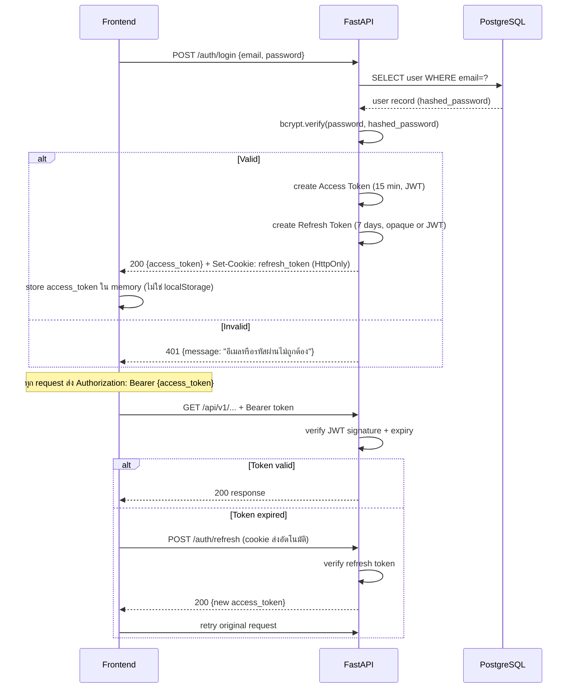

# 09 — Security Design

---

## 9.1 Authentication Flow (JWT)



---

## 9.2 JWT Token Design

### Access Token Payload

```json
{
  "sub": "user-uuid",
  "email": "somchai@example.com",
  "role": "borrower",
  "member_code": "123456",
  "iat": 1714118400,
  "exp": 1714119300
}
```

### Token Storage Strategy

```
Access Token  → JavaScript memory (Pinia store)
              → ไม่เก็บใน localStorage (XSS risk)
              → หายเมื่อ refresh browser (ใช้ refresh token ต่อ)

Refresh Token → HttpOnly Cookie (SameSite=Strict)
              → ไม่อ่านได้จาก JavaScript
              → ส่งอัตโนมัติโดย browser
```

---

## 9.3 RBAC (Role-Based Access Control)

### Role Matrix

| Permission | borrower | staff |
|-----------|----------|-------|
| Login | ✅ | ✅ |
| ดูโปรไฟล์ตัวเอง | ✅ | ✅ |
| แก้ Type A fields | ✅ | ✅ |
| ดูโปรไฟล์สมาชิกทุกคน | ❌ | ✅ |
| แก้ Type B fields (เงินเดือน, หุ้น) | ❌ | ✅ |
| กรอกแบบฟอร์ม | ✅ | ❌ |
| Submit คำขอ | ✅ | ❌ |
| ดูคำขอตัวเอง | ✅ | ✅ |
| ดูคำขอทุกคน | ❌ | ✅ |
| Download PDF ตัวเอง | ✅ | ✅ |
| Download PDF คนอื่น | ❌ | ✅ |
| Approve / Reject | ❌ | ✅ |
| ยกเลิกคำขอตัวเอง | ✅ | ❌ |

### FastAPI Dependency Implementation

```python
# dependencies.py

def require_role(*allowed_roles: str):
    """Role guard dependency"""
    def checker(current_user: User = Depends(get_current_user)):
        if current_user.role not in allowed_roles:
            raise HTTPException(
                status_code=403,
                detail="ไม่มีสิทธิ์เข้าถึง"
            )
        return current_user
    return checker

# ใช้งาน:
@router.get("/staff/applications")
async def list_all_applications(
    staff: User = Depends(require_role("staff"))
):
    ...
```

---

## 9.4 Input Validation (Double Validation)

```
ชั้นที่ 1 — Frontend (Zod)
  → validate ทันทีที่ user กรอก (real-time feedback)
  → ป้องกัน UX ที่ไม่ดี (ไม่ต้องรอ round-trip)

ชั้นที่ 2 — Backend (Pydantic v2)
  → validate ทุก request ก่อน business logic
  → ป้องกัน malicious requests ที่ข้าม frontend ไป
  → เป็น source of truth สำหรับ validation rules
```

### Validation Rules ที่สำคัญ

| Field | Rule |
|-------|------|
| national_id | 13 หลัก, ตัวเลขล้วน, ผ่าน checksum algorithm |
| member_code | 6 หลัก |
| email | RFC 5322 format |
| salary_amount | > 0, decimal 2 ตำแหน่ง |
| loan_amount | > 0, ≤ max_loan (ตามประเภทกู้) |
| installments | 1-120, integer |
| sig_base64 | starts with "data:image/png;base64," |

---

## 9.5 PDF Access Control

```python
# pdf.py router

@router.get("/pdf/{application_id}/download")
async def download_pdf(
    application_id: UUID,
    current_user: User = Depends(get_current_user),
    db: AsyncSession = Depends(get_db)
):
    app = await get_application_or_404(application_id, db)
    
    # ตรวจ ownership
    if current_user.role == "borrower" and app.applicant_id != current_user.id:
        raise HTTPException(status_code=403, detail="ไม่มีสิทธิ์เข้าถึงเอกสารนี้")
    
    pdf = await get_pdf_or_404(application_id, db)
    
    return FileResponse(
        path=pdf.storage_path,
        filename=pdf.file_name,
        media_type="application/pdf"
    )
```

---

## 9.6 Security Headers (Nginx)

```nginx
# coopform.conf
add_header X-Content-Type-Options "nosniff" always;
add_header X-Frame-Options "DENY" always;
add_header X-XSS-Protection "1; mode=block" always;
add_header Referrer-Policy "strict-origin-when-cross-origin" always;
add_header Content-Security-Policy "default-src 'self'; script-src 'self'; style-src 'self' 'unsafe-inline';" always;
```

---

## 9.7 Rate Limiting

```python
# main.py — ใช้ slowapi (ไม่ต้องใช้ Redis)
from slowapi import Limiter
from slowapi.util import get_remote_address

limiter = Limiter(key_func=get_remote_address)

@app.post("/api/v1/auth/login")
@limiter.limit("10/minute")  # เข้มงวดกว่าสำหรับ login
async def login(request: Request, ...):
    ...

@app.post("/api/v1/applications")
@limiter.limit("5/minute")   # ป้องกัน submit ซ้ำ
async def submit_application(request: Request, ...):
    ...
```

---

## 9.8 Password Policy

```
ความยาว : อย่างน้อย 8 ตัวอักษร
Algorithm: bcrypt (cost factor = 12)
Reset    : Admin reset ให้ (ยังไม่มี self-service reset ในระยะแรก)
Initial  : Admin สร้าง account + temporary password → user เปลี่ยนเมื่อ login ครั้งแรก
```
