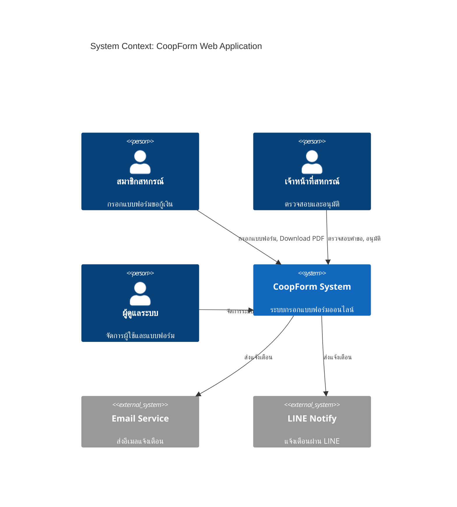
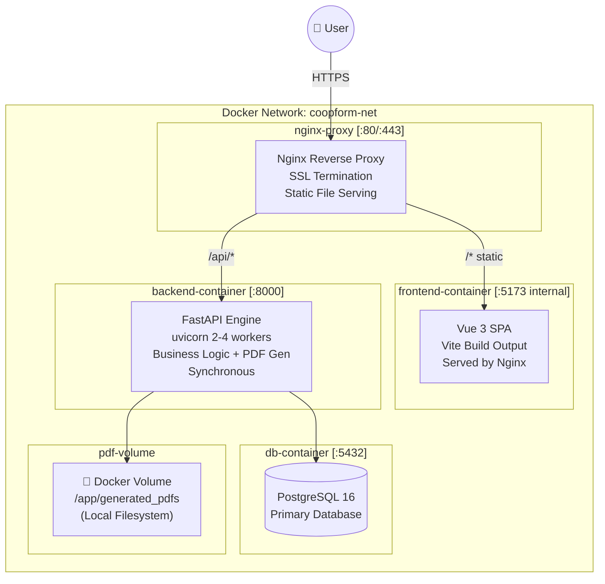
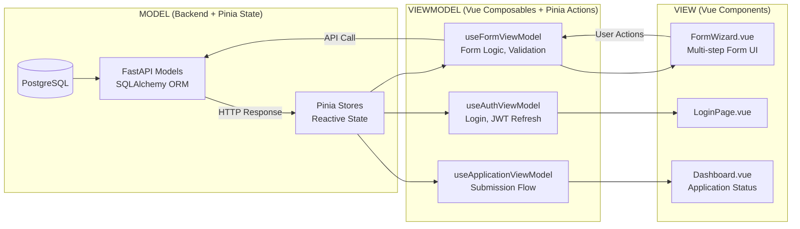
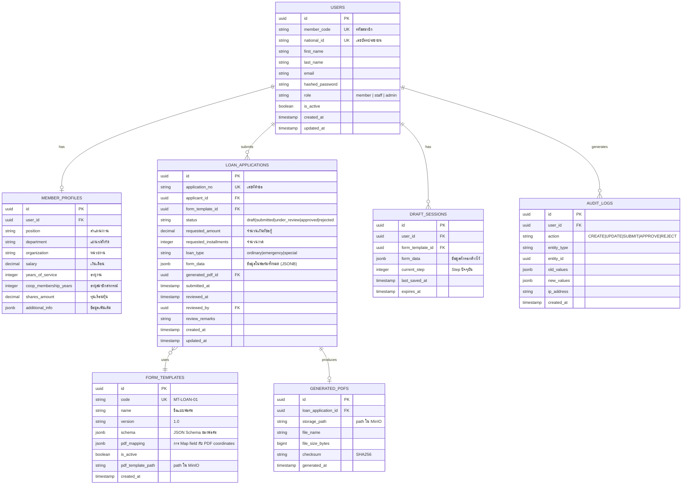
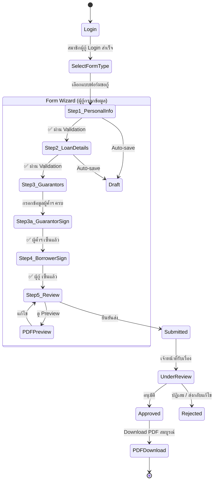
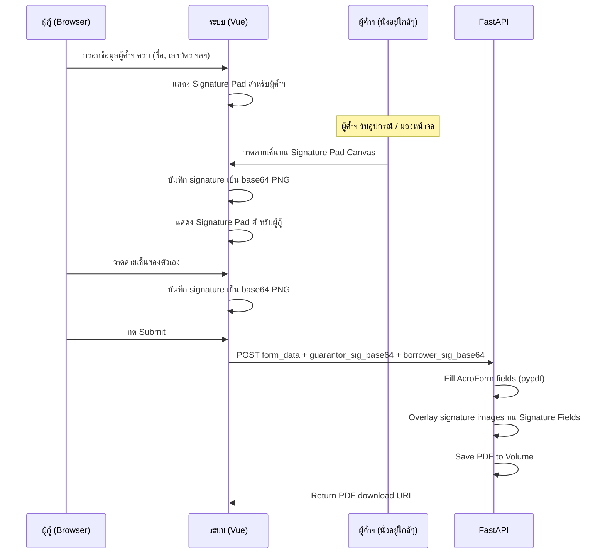
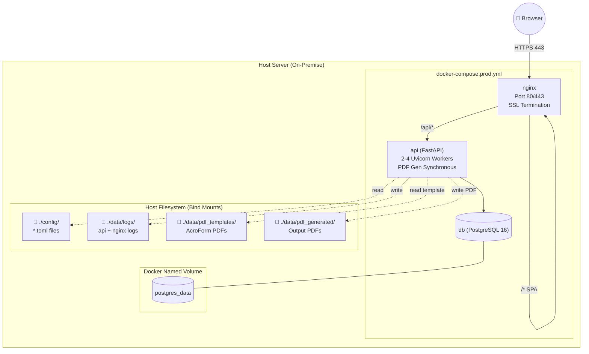

# Master Blueprint: ระบบกรอกแบบฟอร์มสหกรณ์ออมทรัพย์ออนไลน์
### **MTPPR6 CoopForm System — v1.2**
> **สถานะ:** Draft for Review · **วันที่:** 2026-04-06 · **ผู้ออกแบบ:** Antigravity AI Architect  
> **Revision v1.1:** ลด Complexity — ตัด Redis, MinIO, Celery ออก (Scale: 200 สมาชิก / 30 req/hr)  
> **Revision v1.2:** เพิ่ม Directory Structure, Docker Persistence Strategy, TOML Config Design, Member Registration System

---

## 1. Executive Summary

ระบบนี้พัฒนาขึ้นเพื่อให้สมาชิกสหกรณ์ออมทรัพย์สามารถ **กรอกแบบฟอร์มขอกู้เงิน** ที่มีความซับซ้อนสูง (หลายหน้า, มี Business Logic, มีเงื่อนไขการแสดงผล) ผ่านเว็บแอพพลิเคชัน และรับผลลัพธ์เป็นไฟล์ PDF ที่สมบูรณ์พร้อมส่ง

**ปัญหาหลักที่แก้:**
- แบบฟอร์ม PDF กระดาษมีความซับซ้อน เกิดข้อผิดพลาดบ่อย
- ขาด Validation ณ จุดกรอกข้อมูล → ต้องส่งคืนแก้ไขซ้ำ
- ไม่มีระบบติดตามสถานะ/ประวัติการยื่นคำขอ

---

## 2. ความคิดเห็นต่อ System Design ที่เสนอ

> [!NOTE]
> ข้อเสนอของท่านนั้น **ดีมาก** และสอดคล้องกับ Best Practice ของอุตสาหกรรม ผมมีความเห็นเพิ่มเติมดังนี้:

### ✅ จุดที่เห็นด้วย 100%

| ข้อเสนอ | เหตุผล |
|---|---|
| Docker Container สำหรับ Engine | Portability สูง, Deploy ง่าย, Scale ได้ |
| Vue.js + Pinia + Vue Router | Ecosystem สมบูรณ์, MVVM ตรงกับโจทย์ |
| DaisyUI + Tailwind CSS | ประหยัดเวลา Design, Component พร้อมใช้ |
| FastAPI | Async support, Auto OpenAPI docs, Type safety |
| PostgreSQL | ACID compliant, JSON support, Transaction ดีเยี่ยม |
| SQLAlchemy ORM | Industry standard, Migration ง่ายด้วย Alembic |
| **AcroForm PDF (Adobe Acrobat)** | **Named Fields = mapping แม่นยำที่สุด, ไม่ต้อง coordinate!** |

### ⚠️ ข้อเสนอแนะเพิ่มเติม

| ประเด็น | คำแนะนำ |
|---|---|
| **Authentication** | ควรใช้ JWT + Refresh Token (ไม่ใช่ Session-based เพราะ SPA) |
| **PDF Generation** | ใช้ `reportlab` หรือ `pypdf` ที่ Engine ฝั่ง Backend (ไม่ใช่ Frontend) เพื่อความปลอดภัยของ Template |
| **Form State** | Multi-step form ควร Auto-save draft ทุก N วินาที ป้องกันข้อมูลหาย |
| **File Storage** | ควรมี Object Storage (MinIO บน Docker หรือ S3-compatible) สำหรับเก็บ PDF ที่ Generate แล้ว |
| **Redis** | เพิ่ม Redis Container สำหรับ Session Cache, Rate Limiting, Task Queue |
| **MVVM ใน Vue** | Vue 3 Composition API + Pinia เป็น MVVM โดยธรรมชาติ → ✅ |

---

## 3. Technology Stack (Final Recommendation)

```
┌─────────────────────────────────────────────────────────────┐
│                    FRONTEND (SPA)                            │
│  Vue 3 (Composition API) + Vite + TypeScript                 │
│  Vue Router 4 (History Mode)                                 │
│  Pinia (State Management / ViewModel Layer)                  │
│  DaisyUI 4 + Tailwind CSS 3                                  │
│  VeeValidate + Zod (Form Validation)                         │
│  Axios (HTTP Client) + VueUse (Composables)                  │
│  PDF.js (Preview PDF ก่อน Download)                          │
└─────────────────────────────────────────────────────────────┘
              │ HTTPS / REST API + JWT
┌─────────────────────────────────────────────────────────────┐
│                    BACKEND ENGINE (Docker)                   │
│  Python 3.12 + FastAPI + Uvicorn                             │
│  SQLAlchemy 2.0 (ORM) + Alembic (Migration)                  │
│  Pydantic v2 (Schema Validation)                             │
│  python-jose (JWT) + passlib (Password Hashing)              │
│  pypdf 4.x (AcroForm Field Filling by Name)                  │
│  python-multipart (File Upload)                              │
│  Local Volume (Docker Mount สำหรับ PDF files)                │
└─────────────────────────────────────────────────────────────┘
              │ SQLAlchemy ORM
┌─────────────────────────────────────────────────────────────┐
│                    DATA LAYER (Docker)                       │
│  PostgreSQL 16 (Primary Database)                            │
└─────────────────────────────────────────────────────────────┘
```

> [!NOTE]
> **ทำไมตัด Redis, MinIO, Celery?**  
> ด้วย Load ที่ 200 สมาชิก / 30 req/hr — PDF Generation ใช้เวลา < 3 วินาที สามารถทำ **Synchronous** ได้โดยไม่กระทบ UX  
> PDF files เก็บบน **Docker Volume** (Local Filesystem บน Server) แทน MinIO — ง่ายกว่า, Backup ง่าย, ไม่ต้องดูแล Object Storage  
> หาก Scale ขึ้นในอนาคต สามารถเพิ่ม Redis + Celery + MinIO ได้ทีหลังโดยไม่ต้อง refactor logic

---

## 4. Architecture Diagram (C4 Model - Level 2)



---

## 5. Container Architecture (Docker Compose)



---

## 6. MVVM Architecture Pattern



---

## 7. Database Schema (ERD)



---

## 8. API Design (FastAPI Endpoints)

### 8.1 Authentication
```
POST   /api/v1/auth/login          → JWT Access + Refresh Token
POST   /api/v1/auth/refresh        → Renew Access Token
POST   /api/v1/auth/logout         → Invalidate Token
GET    /api/v1/auth/me             → Current User Profile
```

### 8.2 Member Profile
```
GET    /api/v1/members/me/profile  → ดึงข้อมูลสมาชิก (pre-fill form)
PUT    /api/v1/members/me/profile  → อัปเดตข้อมูลส่วนตัว
```

### 8.3 Form Templates
```
GET    /api/v1/forms/templates           → รายการแบบฟอร์มที่ใช้ได้
GET    /api/v1/forms/templates/{id}      → Schema + Mapping ของฟอร์ม
GET    /api/v1/forms/templates/{id}/schema → JSON Schema สำหรับ Validation
```

### 8.4 Draft Management
```
POST   /api/v1/drafts                    → สร้าง Draft ใหม่
GET    /api/v1/drafts/{id}               → ดึง Draft ที่ค้างไว้
PUT    /api/v1/drafts/{id}               → Auto-save Draft
DELETE /api/v1/drafts/{id}               → ลบ Draft
```

### 8.5 Loan Applications
```
POST   /api/v1/applications              → Submit คำขอกู้ (จาก Draft)
GET    /api/v1/applications              → ประวัติคำขอของสมาชิก
GET    /api/v1/applications/{id}         → รายละเอียดคำขอ
GET    /api/v1/applications/{id}/pdf     → Download PDF
POST   /api/v1/applications/{id}/cancel  → ยกเลิกคำขอ

# Staff/Admin endpoints
GET    /api/v1/staff/applications        → รายการคำขอทั้งหมด (Filter/Search)
PUT    /api/v1/staff/applications/{id}/review → อนุมัติ/ปฏิเสธ
```

### 8.6 PDF Operations
```
POST   /api/v1/pdf/preview              → Generate Preview PDF (ไม่บันทึก)
GET    /api/v1/pdf/{id}/download        → Download PDF ที่ Approved แล้ว
```

---

## 9. Frontend Structure (Vue 3 SPA)

```
coopform-frontend/
├── src/
│   ├── assets/                    # Static assets
│   ├── components/
│   │   ├── common/                # Shared UI components
│   │   │   ├── AppButton.vue
│   │   │   ├── AppInput.vue
│   │   │   ├── AppModal.vue
│   │   │   └── AppProgressBar.vue
│   │   ├── form/                  # Form-specific components
│   │   │   ├── FormWizard.vue     # Multi-step wizard container
│   │   │   ├── FormStep.vue       # Single step wrapper
│   │   │   ├── FormField.vue      # Dynamic field renderer
│   │   │   ├── FormSummary.vue    # Step: Review before submit
│   │   │   └── PDFPreview.vue     # PDF.js preview modal
│   │   └── layout/
│   │       ├── AppHeader.vue
│   │       ├── AppSidebar.vue
│   │       └── AppFooter.vue
│   ├── composables/               # ViewModel Layer (Composition API)
│   │   ├── useAuth.ts
│   │   ├── useFormWizard.ts       # Multi-step logic
│   │   ├── useAutoSave.ts         # Draft auto-save
│   │   ├── useFormValidation.ts   # Zod schema validation
│   │   └── useLoanApplication.ts
│   ├── pages/                     # Route-level Views
│   │   ├── LoginPage.vue
│   │   ├── DashboardPage.vue      # ประวัติคำขอ
│   │   ├── ApplicationPage.vue    # หน้ากรอกแบบฟอร์มหลัก
│   │   ├── ApplicationDetailPage.vue
│   │   └── admin/
│   │       ├── AdminDashboard.vue
│   │       └── ApplicationReview.vue
│   ├── stores/                    # Pinia Stores (State)
│   │   ├── auth.store.ts
│   │   ├── form.store.ts          # Form data + steps state
│   │   ├── application.store.ts
│   │   └── ui.store.ts
│   ├── services/                  # API Service Layer
│   │   ├── api.service.ts         # Axios instance + interceptors
│   │   ├── auth.service.ts
│   │   ├── form.service.ts
│   │   └── application.service.ts
│   ├── router/
│   │   └── index.ts               # Vue Router + Route Guards
│   ├── types/                     # TypeScript interfaces
│   │   ├── auth.types.ts
│   │   ├── form.types.ts
│   │   └── application.types.ts
│   └── main.ts
```

---

## 10. Backend Structure (FastAPI Engine)

```
coopform-engine/
├── app/
│   ├── api/
│   │   └── v1/
│   │       ├── routers/
│   │       │   ├── auth.py
│   │       │   ├── members.py         # สมัครสมาชิก + จัดการ Profile
│   │       │   ├── forms.py
│   │       │   ├── drafts.py
│   │       │   ├── applications.py
│   │       │   └── pdf.py
│   │       └── dependencies.py        # Auth guards, DB session, Roles
│   ├── core/
│   │   ├── config.py                  # โหลด settings จาก TOML + .env
│   │   ├── security.py                # JWT logic
│   │   ├── database.py                # SQLAlchemy engine + session
│   │   └── exceptions.py              # Custom exception handlers
│   ├── models/                        # SQLAlchemy ORM Models
│   │   ├── user.py
│   │   ├── member_profile.py
│   │   ├── loan_application.py
│   │   ├── loan_guarantor.py          # ผู้ค้ำประกัน (linked to member)
│   │   ├── form_template.py
│   │   ├── draft_session.py
│   │   └── generated_pdf.py
│   ├── schemas/                       # Pydantic Schemas (DTO)
│   │   ├── auth.py
│   │   ├── member.py
│   │   ├── application.py
│   │   └── form.py
│   ├── services/                      # Business Logic Layer
│   │   ├── auth_service.py
│   │   ├── member_service.py
│   │   ├── application_service.py
│   │   ├── draft_service.py
│   │   └── pdf_service.py             # PDF Generation Engine (pypdf + Pillow)
│   └── main.py                        # FastAPI app entry point
├── migrations/                        # Alembic migrations
│   └── versions/
├── tests/
├── Dockerfile
├── pyproject.toml
└── requirements.txt
```

---

## 11. Multi-Step Form Flow (พร้อม Signature Flow)



### Signature Step Detail



---

## 12. PDF Generation Strategy

> [!IMPORTANT]
> **PDF ของโปรเจกต์นี้ = AcroForm Fillable PDF** สร้างด้วย Adobe Acrobat Pro DC  
> แต่ละ Field มี **Name (ID) ที่ตั้งไว้แล้ว** → Python เรียกชื่อ Field โดยตรงได้เลย  
> **ไม่ต้องใช้ Coordinate Mapping เลย!** — นี่คือความได้เปรียบสูงสุดของ AcroForm

### กลไกการทำงาน

```mermaid
graph TD
    A["User กรอกข้อมูลในเว็บ\n(Vue Form Wizard)"] --> B[Submit → FastAPI]
    B --> C["Validate ด้วย Pydantic Schema"]
    C --> D["Load PDF Template จาก\n/app/pdf_templates/loan_form.pdf"]
    D --> E["pypdf: reader = PdfReader(template)\nwriter = PdfWriter()\nwriter.append(reader)"]
    E --> F["Loop Field Mapping:\nwriter.update_page_form_field_values(\n  page, {field_name: value}\n)"]
    F --> G["Save to Docker Volume\n/app/generated_pdfs/{uuid}.pdf"]
    G --> H["Store metadata in PostgreSQL\n(path, filename, checksum)"]
    
    C --> E[Merge & Flatten Pages]
    D --> E
    E --> F[Save to Docker Volume<br/>/app/generated_pdfs/{uuid}.pdf]
    F --> G[Store path in PostgreSQL<br/>generated_pdfs table]
    G --> H[Return: application_id]
    H --> I["Return application_id to Frontend"]
    I --> J["Frontend: GET /api/v1/pdf/{id}/download"]
    J --> K["FastAPI: FileResponse(path)\nstreams PDF to browser"]
    K --> L["PDF.js Preview Modal\n+ Download Button"]
```

### Field Mapping Design

แทนที่จะใช้ Coordinate Map → ใช้ **Field Name Map** ซึ่งง่ายกว่ามาก:

```
# ตัวอย่าง: ใน FORM_TEMPLATES.field_mapping (JSONB)
{
  "applicant_name":        "txt_fullname",
  "national_id":           "txt_national_id",
  "member_code":           "txt_member_no",
  "department":            "txt_department",
  "salary":                "txt_salary",
  "requested_amount":      "txt_loan_amount",
  "requested_installments":"txt_installments",
  "loan_purpose":          "txt_purpose",
  "guarantor_1_name":      "txt_guarantor1_name",
  "guarantor_1_id":        "txt_guarantor1_id",
  "is_first_loan":         "chk_first_loan"    ← checkbox
}
```

**Key**: ฝั่งซ้าย = ชื่อ field ใน Web Form (Pydantic/Vue)  
**Value**: ฝั่งขวา = ชื่อ Field ที่ตั้งใน Adobe Acrobat Pro DC

### Python Code ที่จะใช้ (pypdf 4.x)

```python
# pdf_service.py — ตัวอย่างแนวทาง (ยังไม่เขียน code จริง)
from pypdf import PdfReader, PdfWriter

def fill_loan_form(form_data: dict, field_mapping: dict, template_path: str) -> bytes:
    reader = PdfReader(template_path)
    writer = PdfWriter()
    writer.append(reader)
    
    # แปลง form_data key → PDF field name ตาม mapping
    pdf_fields = {
        pdf_field: form_data.get(web_field, "")
        for web_field, pdf_field in field_mapping.items()
    }
    
    for page in writer.pages:
        writer.update_page_form_field_values(page, pdf_fields)
    
    output = BytesIO()
    writer.write(output)
    return output.getvalue()
```

> [!TIP]
> `pypdf` (v4.x) เป็น Pure Python, ไม่ต้องติดตั้ง Library ภายนอก — เหมาะมากกับ Docker Container  
> รองรับ **AcroForm** ทั้ง Text fields, Checkboxes, Radio buttons, Dropdowns

> [!NOTE]
> PDF template file จะเก็บใน **Docker Volume** (`/app/pdf_templates/`)  
> สามารถ Update template ใหม่ได้โดยไม่ต้อง rebuild container

---

## 13. Signature Technology Stack

### JS Library: `signature_pad` (by Szymek)

```
npm install signature_pad
```

- ⭐ 9k+ stars บน GitHub — มาตรฐานอุตสาหกรรม
- รองรับ Mouse, Touch, Stylus
- Export เป็น PNG / SVG / base64 ได้ทันที
- น้ำหนักเบา Zero dependencies

---

## 14. Security Design

| Layer | Mechanism |
|---|---|
| **Authentication** | JWT Access Token (15 นาที) + Refresh Token (7 วัน, HttpOnly Cookie) |
| **Authorization** | Role-Based Access Control (RBAC): `member` / `staff` / `admin` |
| **CORS** | Whitelist เฉพาะ Origin ของ Frontend เท่านั้น |
| **Input Validation** | Pydantic v2 (Backend) + Zod (Frontend) — Double validation |
| **HTTPS** | SSL/TLS terminate ที่ Nginx reverse proxy |
| **PDF Access** | ตรวจ ownership ก่อน serve ไฟล์ (เฉพาะเจ้าของ + staff) |
| **Profile Type B** | Staff เท่านั้นที่แก้ไขข้อมูลการเงิน (salary, shares, debt) |

---

## 15. Project Directory Structure & Docker Persistence

> [!IMPORTANT]
> นี่คือหัวใจของการออกแบบ Docker — **แยกให้ชัดว่า "อะไรต้องอยู่รอด" เมื่อ Container ถูก restart หรือ remove**

### หลักการ: Ephemeral vs Persistent

```
┌─────────────────────────────────────────────────────────────┐
│  EPHEMERAL (อยู่ใน Image — หายได้, rebuild ได้)              │
│    ✗ Application source code (baked into image)              │
│    ✗ Python dependencies                                     │
│    ✗ Node modules / Vue build cache                          │
└─────────────────────────────────────────────────────────────┘
┌─────────────────────────────────────────────────────────────┐
│  PERSISTENT (ต้องอยู่รอดเสมอ — ใช้ Bind Mount หรือ Volume)  │
│    ✅ PostgreSQL data                  → Named Volume         │
│    ✅ Generated PDF files             → Bind Mount           │
│    ✅ PDF Template files              → Bind Mount           │
│    ✅ TOML Config files               → Bind Mount           │
│    ✅ Log files                       → Bind Mount           │
└─────────────────────────────────────────────────────────────┘
```

> [!NOTE]
> ใช้ **Bind Mount** (เชื่อมกับโฟลเดอร์จริงบน Host) สำหรับ config, logs, PDFs  
> เพราะ Admin สามารถ **แก้ไข config ได้โดยตรง** จาก Host โดยไม่ต้อง rebuild container  
> ใช้ **Named Volume** สำหรับ PostgreSQL เท่านั้น (Docker จัดการ performance ให้)

---

### Full Project Directory Structure

```
coopform2/                                    ← ROOT PROJECT (git repo)
│
├── docker-compose.yml                        ← Dev environment
├── docker-compose.prod.yml                   ← Production environment
├── .env.example                              ← Template (commit to git)
├── .env                                      ← Secrets (gitignore!)
├── .gitignore
├── README.md
│
├── config/                                   ← 📌 BIND MOUNT → ทุก container
│   ├── app.toml                              ← Main application config
│   ├── logging.toml                          ← Log levels, handlers, format
│   ├── security.toml                         ← JWT expiry, CORS origins
│   └── forms/                               ← Form-specific configs
│       ├── loan_ordinary.toml               ← กู้สามัญ: steps, fields, rules
│       ├── loan_emergency.toml              ← กู้ฉุกเฉิน
│       └── loan_special.toml               ← กู้พิเศษ
│
├── data/                                     ← 📌 PERSISTENT DATA (gitignore!)
│   ├── postgres/                             ← Named Volume (Docker manages)
│   ├── pdf_templates/                        ← 📌 BIND MOUNT → api container
│   │   ├── loan_ordinary_v1.pdf             ← AcroForm template (Adobe Acrobat)
│   │   ├── loan_emergency_v1.pdf
│   │   └── loan_special_v1.pdf
│   ├── pdf_generated/                        ← 📌 BIND MOUNT → api container
│   │   └── 2026/04/                         ← จัดเป็น Year/Month
│   │       └── {uuid}.pdf
│   └── logs/                                ← 📌 BIND MOUNT → ทุก container
│       ├── api/
│       │   ├── app.log                      ← Application log
│       │   └── error.log                    ← Error log เท่านั้น
│       ├── nginx/
│       │   ├── access.log
│       │   └── error.log
│       └── db/
│           └── postgresql.log
│
├── nginx/                                    ← Nginx container config
│   ├── Dockerfile
│   ├── nginx.conf
│   └── conf.d/
│       └── coopform.conf                    ← Server block, proxy rules
│
├── backend/                                  ← FastAPI Engine
│   ├── Dockerfile
│   ├── pyproject.toml                        ← Project metadata + deps
│   ├── requirements.txt                      ← pip freeze output
│   ├── alembic.ini                           ← Alembic config
│   ├── migrations/
│   │   ├── env.py
│   │   └── versions/
│   │       └── 001_initial_schema.py
│   ├── tests/
│   │   ├── test_auth.py
│   │   ├── test_members.py
│   │   ├── test_pdf_service.py
│   │   └── conftest.py
│   └── app/
│       ├── main.py                           ← FastAPI entry point
│       ├── api/
│       │   └── v1/
│       │       ├── routers/
│       │       │   ├── auth.py
│       │       │   ├── members.py
│       │       │   ├── forms.py
│       │       │   ├── drafts.py
│       │       │   ├── applications.py
│       │       │   └── pdf.py
│       │       └── dependencies.py
│       ├── core/
│       │   ├── config.py                     ← โหลด app.toml + .env
│       │   ├── logging_setup.py              ← โหลด logging.toml
│       │   ├── security.py
│       │   ├── database.py
│       │   └── exceptions.py
│       ├── models/
│       │   ├── user.py
│       │   ├── member_profile.py
│       │   ├── loan_application.py
│       │   ├── loan_guarantor.py
│       │   ├── form_template.py
│       │   ├── draft_session.py
│       │   └── generated_pdf.py
│       ├── schemas/
│       │   ├── auth.py
│       │   ├── member.py
│       │   ├── application.py
│       │   └── form.py
│       └── services/
│           ├── auth_service.py
│           ├── member_service.py
│           ├── application_service.py
│           ├── draft_service.py
│           └── pdf_service.py
│
└── frontend/                                 ← Vue 3 SPA
    ├── Dockerfile
    ├── package.json
    ├── vite.config.ts
    ├── tsconfig.json
    ├── tailwind.config.js
    └── src/
        ├── main.ts
        ├── assets/
        ├── components/
        │   ├── common/
        │   │   ├── AppButton.vue
        │   │   ├── AppInput.vue
        │   │   ├── AppModal.vue
        │   │   └── AppProgressBar.vue
        │   ├── form/
        │   │   ├── FormWizard.vue
        │   │   ├── FormStep.vue
        │   │   ├── FormField.vue
        │   │   ├── FormSummary.vue
        │   │   ├── SignaturePad.vue           ← signature_pad wrapper
        │   │   └── PDFPreview.vue
        │   └── layout/
        │       ├── AppHeader.vue
        │       ├── AppSidebar.vue
        │       └── AppFooter.vue
        ├── composables/
        │   ├── useAuth.ts
        │   ├── useFormWizard.ts
        │   ├── useAutoSave.ts
        │   ├── useSignature.ts               ← Signature Pad logic
        │   ├── useFormValidation.ts
        │   └── useLoanApplication.ts
        ├── pages/
        │   ├── LoginPage.vue
        │   ├── DashboardPage.vue
        │   ├── ProfilePage.vue               ← แก้ไขข้อมูลส่วนตัว (Type A)
        │   ├── ApplicationPage.vue
        │   ├── ApplicationDetailPage.vue
        │   └── admin/
        │       ├── AdminDashboard.vue
        │       ├── MemberManagement.vue      ← จัดการสมาชิก (Type B)
        │       └── ApplicationReview.vue
        ├── stores/
        │   ├── auth.store.ts
        │   ├── member.store.ts
        │   ├── form.store.ts
        │   ├── application.store.ts
        │   └── ui.store.ts
        ├── services/
        │   ├── api.service.ts
        │   ├── auth.service.ts
        │   ├── member.service.ts
        │   ├── form.service.ts
        │   └── application.service.ts
        ├── router/
        │   └── index.ts
        └── types/
            ├── auth.types.ts
            ├── member.types.ts
            ├── form.types.ts
            └── application.types.ts
```

---

### TOML Config File Design

#### `config/app.toml`
```toml
[app]
name = "CoopForm System"
version = "1.2.0"
debug = false

[server]
host = "0.0.0.0"
port = 8000
workers = 2

[database]
# URL อ่านจาก .env เพื่อซ่อน password
pool_size = 5
max_overflow = 10
echo_sql = false          # true เฉพาะ dev

[pdf]
templates_dir = "/app/data/pdf_templates"
generated_dir = "/app/data/pdf_generated"
max_file_size_mb = 10
autoclean_days = 365      # ลบ PDF เก่ากว่า 1 ปี

[auth]
access_token_expire_minutes = 15
refresh_token_expire_days = 7
algorithm = "HS256"
```

#### `config/logging.toml`
```toml
[logging]
level = "INFO"            # DEBUG | INFO | WARNING | ERROR
format = "{time:YYYY-MM-DD HH:mm:ss} | {level} | {name} | {message}"

[logging.handlers.file]
enabled = true
path = "/app/data/logs/api/app.log"
rotation = "10 MB"        # หมุนไฟล์เมื่อใหญ่กว่า 10MB
retention = "30 days"     # เก็บ log ย้อนหลัง 30 วัน
compression = "zip"

[logging.handlers.error_file]
enabled = true
path = "/app/data/logs/api/error.log"
level = "ERROR"           # เฉพาะ error
rotation = "5 MB"
retention = "90 days"

[logging.handlers.console]
enabled = true            # false ใน production
```

#### `config/forms/loan_ordinary.toml` (ตัวอย่าง)
```toml
[form]
code = "LOAN-ORD-01"
name = "แบบฟอร์มขอกู้เงินสามัญ"
version = "1.0"
pdf_template = "loan_ordinary_v1.pdf"
max_loan_amount = 1000000
max_installments = 120

[steps]
order = ["personal", "loan_details", "guarantors", "signatures", "review"]

[steps.personal]
title = "ข้อมูลผู้กู้"
fields = ["member_code", "fullname", "national_id", "department", "salary"]
pre_fill_from_profile = true    # ดึงจาก Member Profile อัตโนมัติ

[steps.guarantors]
title = "ผู้ค้ำประกัน"
min_count = 1
max_count = 2
require_member = true           # ผู้ค้ำต้องเป็นสมาชิกสหกรณ์

[pdf_field_mapping]
# web_field = "acroform_field_name"
applicant_name        = "txt_fullname"
national_id           = "txt_national_id"
member_code           = "txt_member_no"
department            = "txt_department"
salary                = "txt_salary"
requested_amount      = "txt_loan_amount"
requested_installments = "txt_installments"
loan_purpose          = "txt_purpose"
guarantor_1_name      = "txt_g1_name"
guarantor_1_id        = "txt_g1_national_id"

[pdf_signature_fields]
# field_name ใน AcroForm → ใช้ดึง rect แล้ว overlay PNG
borrower_signature    = "sig_borrower"
guarantor_1_signature = "sig_guarantor1"
```

---

### Docker Persistence Summary

| Data | Strategy | ทำไม? | อยู่รอดเมื่อ Container ถูก remove? |
|---|---|---|---|
| **PostgreSQL data** | Named Volume (`postgres_data`) | Docker จัดการ performance | ✅ ใช่ |
| **PDF ที่ Generate** | Bind Mount (`./data/pdf_generated`) | Admin เข้าถึงได้จาก Host | ✅ ใช่ |
| **PDF Templates** | Bind Mount (`./data/pdf_templates`) | Update template ง่าย | ✅ ใช่ |
| **TOML Configs** | Bind Mount (`./config`) | แก้ไขได้โดยไม่ rebuild | ✅ ใช่ |
| **Log files** | Bind Mount (`./data/logs`) | อ่าน log ง่ายจาก Host | ✅ ใช่ |
| **App code** | Inside Image (baked in) | Deploy ด้วย image ใหม่ | ❌ (ตั้งใจ) |

> [!CAUTION]
> โฟลเดอร์ `data/` และ `.env` ต้องอยู่ใน `.gitignore` เสมอ  
> ห้าม commit ข้อมูลจริงหรือ password ขึ้น git repository!

---

## 16. Deployment Architecture



### docker-compose.yml Services

| Service | Image | Port | Role |
|---|---|---|---|
| `nginx` | nginx:alpine | 80/443 | Reverse Proxy + Serve Vue SPA |
| `api` | `./backend` (custom build) | 8000 (internal) | FastAPI + PDF Engine |
| `db` | postgres:16-alpine | 5432 (internal) | Primary Database |

> [!TIP]
> เพียง **3 Services** — `docker-compose up -d` แล้วใช้งานได้เลย  
> Backup ง่ายมาก: `tar -czf backup.tar.gz ./data/ ./config/` + `docker exec db pg_dump ...`

---

## 17. Development Phases (Roadmap)

### Phase 1 — Foundation & Infrastructure (2-3 สัปดาห์)
- [ ] สร้าง Directory Structure ตาม Blueprint
- [ ] ออกแบบ TOML config files ทั้งหมด
- [ ] ตั้งค่า Docker Compose (dev + prod)
- [ ] FastAPI scaffold + SQLAlchemy models
- [ ] Alembic migrations (initial schema)
- [ ] Bind mounts + Volume ทดสอบ Persistence

### Phase 2 — Authentication & Member System (2-3 สัปดาห์)
- [ ] Authentication system (JWT + Refresh Token)
- [ ] Member Registration (Admin สร้าง + สมาชิกแก้ไขส่วนตัว)
- [ ] RBAC: member / staff / admin roles
- [ ] Vue 3 + Vite + Pinia setup
- [ ] Login page + Route guards
- [ ] Member Profile page (Type A editable)

### Phase 3 — Core Form Engine (3-4 สัปดาห์)
- [ ] TOML-driven Form Schema loader
- [ ] Multi-step Form Wizard (generic component)
- [ ] Auto-fill from Member Profile
- [ ] Guarantor lookup (ค้นด้วยรหัสสมาชิก)
- [ ] Auto-save Draft
- [ ] Form Validation (Pydantic + Zod)
- [ ] SignaturePad.vue component

### Phase 4 — PDF Engine (2-3 สัปดาห์)
- [ ] pypdf AcroForm field filling
- [ ] Signature PNG overlay (Pillow)
- [ ] PDF.js preview modal
- [ ] TOML-driven field mapping ต่อ form
- [ ] Download endpoint + ตรวจ ownership

### Phase 5 — Workflow & Staff UI (2 สัปดาห์)
- [ ] Staff review dashboard
- [ ] Approve/Reject workflow
- [ ] Admin: Member management (Type B data)
- [ ] Application status tracking

### Phase 6 — Testing & Deployment (1-2 สัปดาห์)
- [ ] Unit tests (pytest + vitest)
- [ ] Docker production build
- [ ] Backup script (pg_dump + tar data/)
- [ ] Log rotation verification
- [ ] User acceptance testing (UAT)

---

## 18. Open Questions (ยังรอคำตอบ)

> [!IMPORTANT]
> **คำถามที่ยังต้องการคำตอบ:**

1. **แบบฟอร์มกี่ประเภท?** — มีกี่ประเภท? (สามัญ, ฉุกเฉิน, พิเศษ?) Field และ Step ต่างกันมากแค่ไหน?

2. **Deployment Target?** — Server อยู่ที่ไหน? On-Premise? VPS? มี Domain + SSL Certificate แล้วหรือยัง?

3. **เอกสารแนบ?** — มีการ Upload ไฟล์ (สำเนาบัตร, slip เงินเดือน) หรือไม่? ถ้ามีจะเก็บใน `data/attachments/` เพิ่มได้เลย

4. **Type B Data — ใครจัดการ?** — ข้อมูลการเงิน (เงินเดือน, ทุนหุ้น, ยอดหนี้) ให้ Staff กรอกเอง หรือให้สมาชิกกรอกแล้ว Staff ตรวจสอบ?

---

## ✅ คำถามที่ได้รับคำตอบแล้ว

| ประเด็น | คำตอบ |
|---|---|
| PDF Type | AcroForm Fillable PDF (Adobe Acrobat Pro DC) ✅ |
| Scale | 200 สมาชิก / 30 req/hr ✅ |
| Signature | Signature Pad (นั่งใกล้กัน) — `signature_pad` JS ✅ |
| Legacy System | ไม่มี — สร้าง Member Profile ใหม่ในระบบนี้เลย ✅ |
| Infra Complexity | ลด — ใช้แค่ nginx + api + db (3 containers) ✅ |
